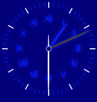
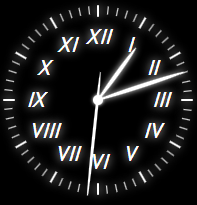

# Steps

1. Create a container for the analog clock;
2. Add dials;

    2.1. Properly style the dials;  
3. Add clock hands;

    3.1. Properly style the clock hands;
4. Add a clock hand pivot;
5. Add seconds dials;

    5.1. Also properly style the dials;
6. Style clock with additional features;
7. Adapt the analog clock for Lab work 3.
Result:

